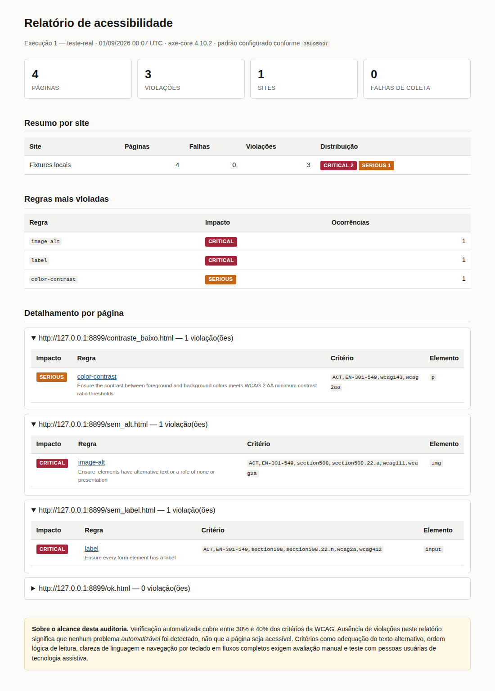

# a11y-audit

Auditoria de acessibilidade web em lote, com histórico entre execuções.

O axe DevTools e o Lighthouse analisam uma página por vez e não guardam o resultado.
Essa ferramenta roda em cima de uma lista de URLs e compara com a auditoria anterior,
mostrando o que foi corrigido e o que apareceu de novo.



## Instalação

```bash
git clone https://github.com/SEU-USUARIO/a11y-audit.git
cd a11y-audit
pip install -e .
python -m playwright install chromium
```

## Uso

```bash
cp examples/sites.yaml sites.yaml

a11y-audit run --config sites.yaml --label baseline
a11y-audit run --config sites.yaml --label pos-correcao
a11y-audit compare-runs --from 1 --to 2
a11y-audit report --run 2 --baseline 1 --output relatorio.html
```

Saída do `compare-runs`:

```
Novas: 0

Corrigidas: 2
  serious   frame-title    https://exemplo.gov.br/  #mapa >>> iframe
  moderate  region         https://exemplo.gov.br/  h1

Persistentes: 3
```

Outros comandos: `runs` lista as execuções gravadas, `export` gera CSV.

## Configuração

```yaml
concurrency: 4          # páginas em paralelo
delay_ms: 500           # intervalo entre requisições
timeout_ms: 30000
respect_robots: true
standard: wcag21aa      # wcag2a, wcag2aa, wcag21a, wcag21aa, wcag22aa
min_impact: null        # minor, moderate, serious, critical

ignored_rules:
  - region

sites:
  - name: Portal Exemplo
    urls:
      - https://exemplo.gov.br/
      - https://exemplo.gov.br/contato
```

## Como funciona

Playwright abre cada página, injeta o axe-core e coleta o resultado. Os dados vão para
SQLite via SQLAlchemy (dá para usar PostgreSQL passando `--db postgresql://...`).

Algumas notas de implementação:

- O padrão WCAG é expandido para o conjunto acumulado de tags. O axe marca cada regra
  com o nível em que ela foi introduzida, então `image-alt` é `wcag2a` mesmo valendo
  para 2.1 AA. Filtrar só por `wcag21aa` roda quase nada.
- Uma violação é identificada por URL + regra + seletor CSS. Se o site é
  reestruturado, o seletor muda e a mesma violação aparece como corrigida e nova ao
  mesmo tempo. Não achei jeito melhor sem cooperação do site auditado.
- A versão do axe-core fica registrada em cada execução, porque regras mudam de nome
  entre versões e isso bagunçaria a comparação. Se as duas execuções usarem versões
  diferentes, a ferramenta avisa.
- URLs que só existem em uma das execuções ficam fora do diff, senão uma URL nova
  entraria inteira como "violações novas".
- Página com status 400 ou maior é registrada, mas não auditada. O HTML nesse caso é a
  página de erro do servidor.

## Limitações

Verificação automatizada cobre de 30% a 40% dos critérios da WCAG. Relatório sem
violações quer dizer que nada automatizável foi detectado, não que a página seja
acessível.

Fora do alcance da ferramenta: qualidade do texto alternativo, ordem de leitura e de
foco, clareza de linguagem, navegação por teclado em fluxos completos, legendas e
audiodescrição. Também não audita página com login nem conteúdo que só aparece depois
de interação.

## Desenvolvimento

```bash
pip install -e ".[dev]"
python -m playwright install chromium

pytest
pytest -m "not browser"   # sem navegador
ruff check src tests
```

Os testes de integração sobem um servidor local servindo páginas com violações
plantadas (`tests/fixtures/pages/`), em vez de auditar site de terceiro. Assim o
resultado não depende de rede nem muda sozinho.

Com Docker:

```bash
docker build -t a11y-audit .
docker run --rm -v "$PWD:/data" -w /data a11y-audit run --config sites.yaml
```

## Roadmap

- [ ] Páginas autenticadas
- [ ] Exportação em JSON
- [ ] `--fail-on critical` para usar em pipeline
- [ ] Descoberta de URLs por sitemap.xml
- [ ] Guardar as checagens `incomplete`, hoje só contadas
